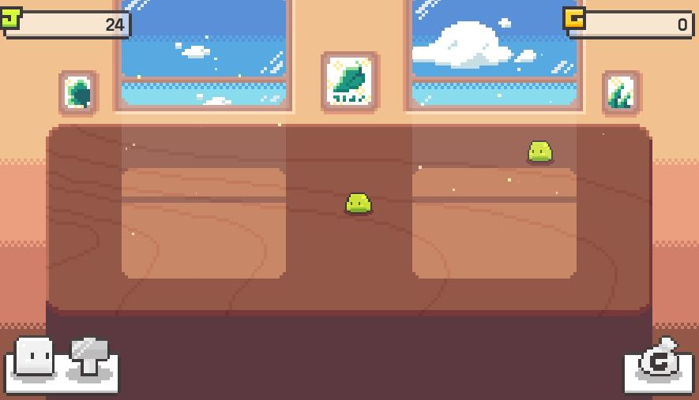
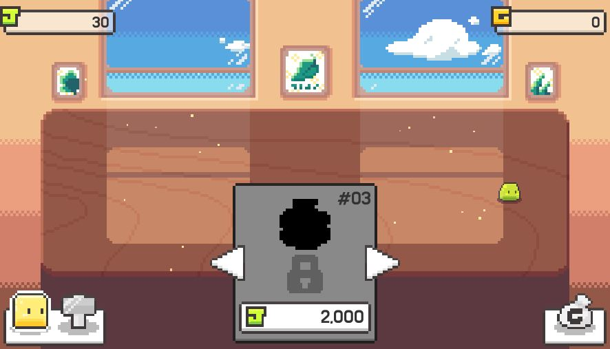
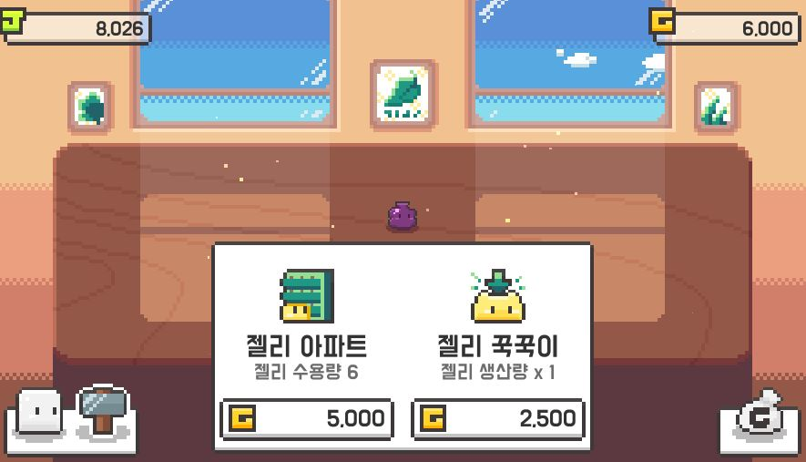
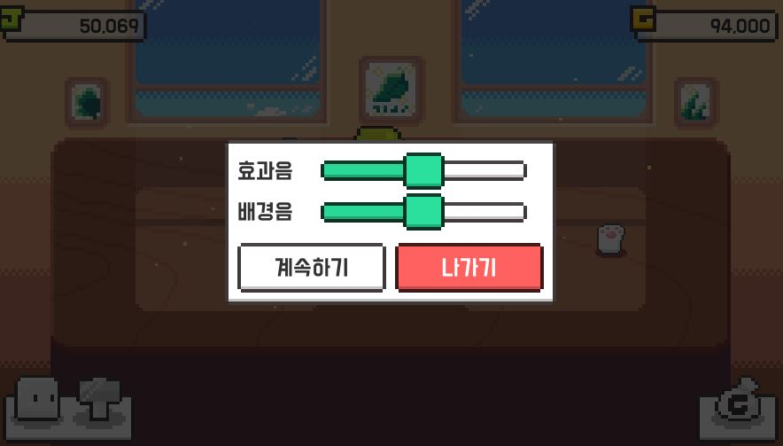

## *참고
<a href='https://www.youtube.com/watch?v=G6NronfnXfg&list=PLO-mt5Iu5TeZA0y889ZMi9wJafthif03i'>젤리 키우기 게임 - 도트 장면 만들기 [유니티 볼트 기초 강좌 V07 + 에셋 다운로드]</a>

Unity로 Dino Run 게임에 이어 Jelly Farm이라는 방치형 클리커 게임을 만들었으며 BOLT라는 비주얼 스크립팅도구와 C# 스크립팅을 사용하였습니다.

일반적으로 현재 게임 시장에 있는 방치형 클리커 게임이며, 거의 모든 기능을 구현했다고 생각합니다. Unity 프로젝트나 게임 메이킹에 대해서 많이 배웠습니다.

## Preview

